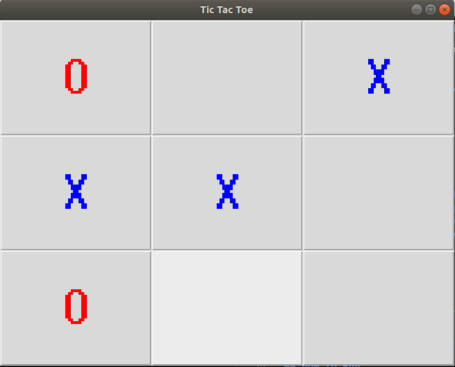

# Tic Tac Toe 🎮

A simple two-player Tic Tac Toe game built with Python and Tkinter.

## Screenshot



## Features

- Two-player local gameplay (Player 1 vs Player 2)
- Visual distinction between players — **X** appears in blue, **O** in red
- Automatic win detection across rows, columns, and diagonals
- Tie detection when the board is full with no winner
- Auto-resets the board after each game ends

## Requirements

- Python 3.x
- Tkinter (included in the Python standard library)

No external packages are required.

## How to Run

```bash
python main.py
```

## How to Play

1. The game starts with **Player 1 (X)**.
2. Click any empty cell to place your mark.
3. Players alternate turns automatically.
4. The game announces the winner or a tie via a popup dialog.
5. The board resets automatically after each round.

## Win Conditions

The game checks for:
- ✅ Any full **row** with matching symbols
- ✅ Any full **column** with matching symbols
- ✅ Either **diagonal** with matching symbols
- 🤝 A **tie** if all 9 cells are filled with no winner

## License

This project is open source and free to use under the [MIT License](../LICENSE).

## 👏 Acknowledgments

- Built with Python's built-in Tkinter library
- Based on the Udemy course: ["Python Game Development"](https://www.udemy.com/course/master-python-game-development/)
